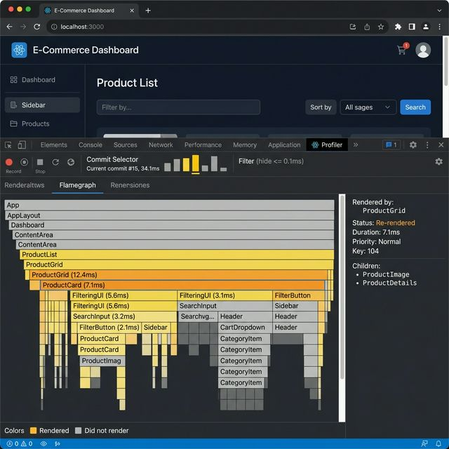
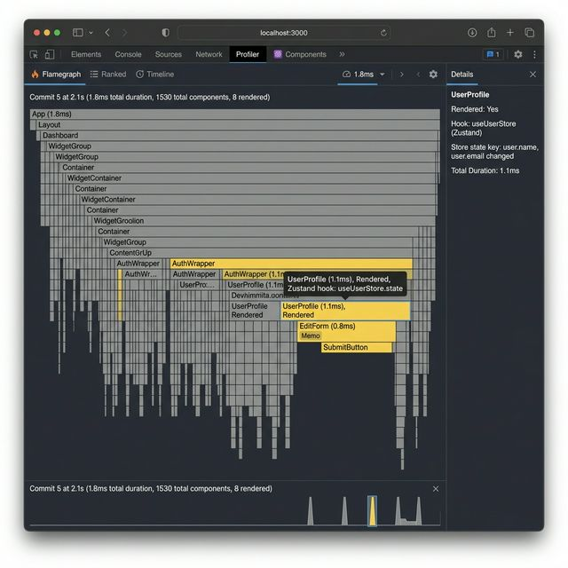
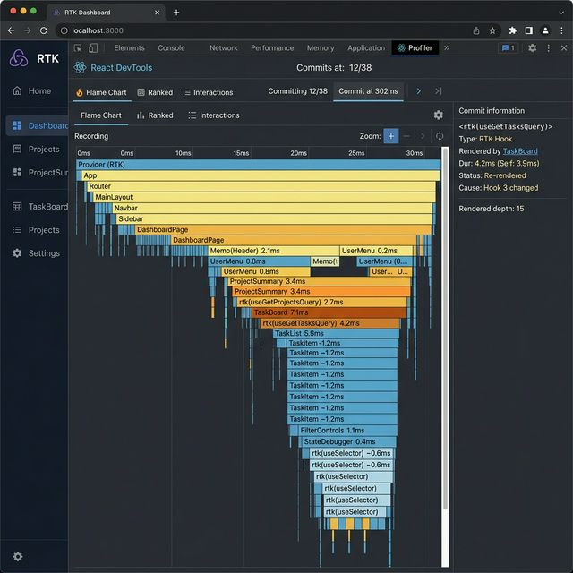

# Performance & Architecture Comparison

## Summary Table

| Metric | Context (Naive) | Context (Split) | Zustand | Redux Toolkit |
| :--- | :--- | :--- | :--- | :--- |
| **Bundle Size (Gzipped)** | 63.0 kB | 63.0 kB | 63.1 kB | 71.1 kB |
| **Boilerplate Level** | Low | Medium | Very Low | High |
| **Render Efficiency** | Poor (Waterfall) | Good (Targeted) | Excellent | Excellent |
| **State Organization** | Single Tree | Fragmented | Centralized | Highly Structured |
| **Time-Travel Debugging** | No | No | Optional | Native |

## Render Counts (10 "Add to Cart" Actions)

| Component | Context (Naive) | Context (Split) | Zustand | Redux Toolkit |
| :--- | :--- | :--- | :--- | :--- |
| Header | 11 | 11 | 11 | 11 |
| ProductList | 11 | 1 | 1 | 1 |
| ProductCard | 11 | 1 | 1 | 1 |
| CartSidebar | 11 | 11 | 11 | 11 |
| CartItem | 11 | 11 | 11 | 11 |

## Visual Evidence

### Profiling Screenshots
- **Context Optimized**: 
- **Zustand**: 
- **Redux Toolkit**: 

### Bundle Analysis
- **Zustand**: 
- **Redux Toolkit**: 

### Decision Guide

Choose **React Context** when:
- You are building a small to medium application with low state complexity.
- You want to avoid external dependencies.
- You have the time to carefully split contexts to avoid performance pitfalls.

Choose **Zustand** when:
- You want a minimalist, hook-based API that feels like native React.
- Performance and bundle size are top priorities.
- You want to avoid the "Provider Hell" associated with splitting multiple contexts.
- You need a simple way to access state outside of React components.

Choose **Redux Toolkit** when:
- You are working on a large-scale application with a large team.
- You need strict architectural conventions and predictable state updates.
- Powerful debugging tools (Time-Travel) and middleware support are essential.
- You are already integrated with the Redux ecosystem.
